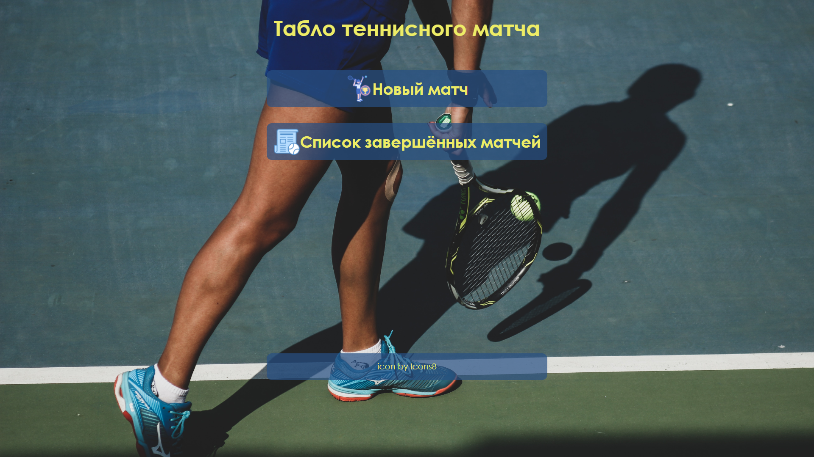
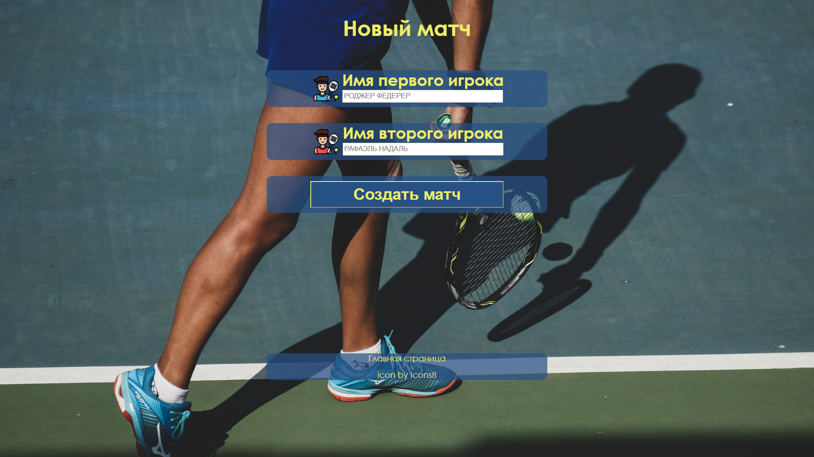
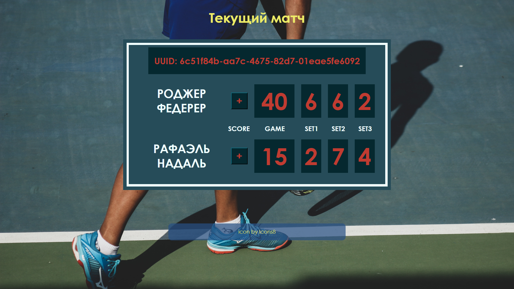
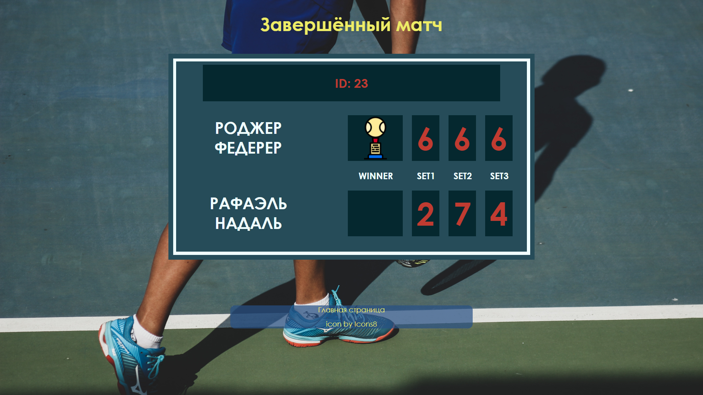
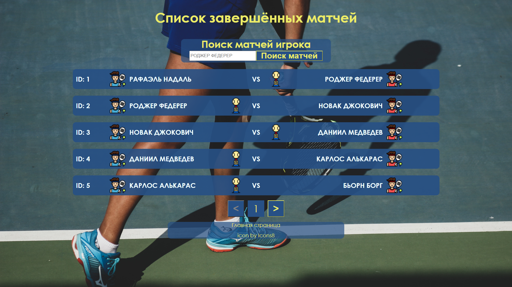
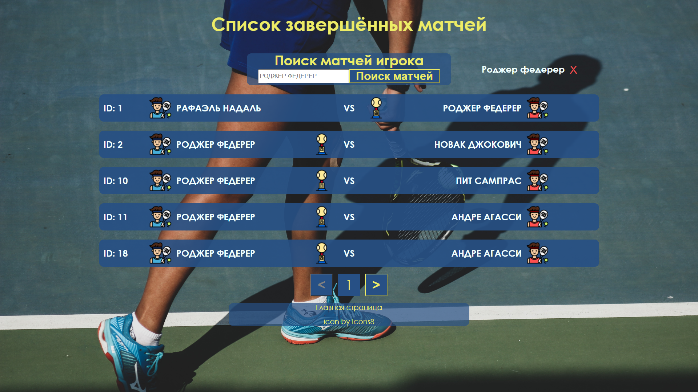

# Проект “Tабло теннисного матча”
Описание и ТЗ проекта доступно по адресу:  
https://zhukovsd.github.io/java-backend-learning-course/Projects/TennisScoreboard/

Приложение доступно по адресу:  
http://62.109.17.145:8080/TennisScoreboard-1.0/ 

<h2>Используемые версии </h2>
<ul>
    <li>JDK 17</li>
    <li>Tomcat 9.0.78</li>
    <li>Hibernate 5.4.11.Final</li>
</ul>

<h2>Используемые технологии</h2>
<ul>
  <li>Java</li>
  <li>Java servlets</li>
  <li>JSP</li>
  <li>SQL</li>
  <li>H2 (in-memory SQL database)</li>
  <li>Hibernate</li>
  <li>HTML/CSS</li>
  <li>JUnit 5</li>
  <li>Паттерн MVC(S)</li>
  <li>Maven</li>
  <li>Apache Tomcat</li>
</ul>

<h2>Мотивация проекта</h2>
<ul>
    <li>Создать клиент-серверное приложение с веб-интерфейсом</li>
    <li>Получить практический опыт работы с ORM Hibernate</li>
    <li>Сверстать простой веб-интерфейс без сторонних библиотек</li>
    <li>Познакомиться с архитектурным паттерном MVC(S)</li>
</ul>

<h2>Функционал приложения</h2>
Работа с матчами:
<ul>
    <li>Создание нового матча</li>
    <li>Просмотр законченных матчей, поиск матчей по именам игроков</li>
    <li>Подсчёт очков в текущем матче</li>
</ul>

<h2>Интерфейс приложения</h2>
<h3>Главная страница</h3>
Интерфейс:
<ul>
    <li>Ссылки, ведущие на страницы нового матча и списка завершенных матчей</li>
</ul>

<h3>Страница нового матча - /new-match</h3>
Интерфейс:
<ul>
    <li>HTML форма с полями “Имя первого игрока”, “Имя второго игрока” и кнопкой “Создать матч”</li>
    <li>Нажатие кнопки “Создать матч”” приводит к POST запросу по адресу /new-match</li>
</ul>
Обработчик POST запроса:
<ul>
    <li>Проверяет существование игроков в таблице Players. Если игрока с таким именем не существует, то он создаётся</li>
    <li>Создаётся экземпляр класса MatchScore и кладётся в коллекцию текущих матчей. Ключом коллекции является UUID, значением - экземпляр класса MatchScore</li>
    <li>Редирект на страницу /match-score?uuid=$match_id</li>
</ul>

<h3>Страница счёта матча - /match-score</h3>

Адрес - /match-score?uuid=$match_id. GET параметр uuid содержит UUID матча.

Интерфейс:
<ul>
    <li>Таблица с именами игроков, текущим счётом</li>
    <li>Формы и кнопки для действий - “игрок 1 выиграл текущее очко”, “игрок 2 выиграл текущее очко”</li>
    <li>Нажатие кнопок приводит к POST запросу по адресу /match-score?uuid=$match_id, в полях отправленной формы содержится айди выигравшего очко игрока</li>
    
</ul>
Обработчик POST запроса:
<ul>
    <li>Извлекает из коллекции экземпляр класса MatchScore</li>
    <li>В соответствии с тем, какой игрок выиграл очко, обновляет счёт матча</li>
    <li>Если матч не закончился - рендерится таблица счёта матча с кнопками, описанными выше</li>
    <li>Если матч закончился, он удаляется из коллекции текущих матчей и записывается в SQL базу данных, рендерится финальный счёт
</ul>

<h3>Страница сыгранных матчей - /matches</h3>
Постранично отображает список сыгранных матчей. Позволяет искать матчи игрока по его имени. 
Адрес - /matches?page=$page_number&filter_by_player_name=$player_name. GET параметры:
<ul>
    <li>page - номер страницы. Если параметр не задан, подразумевается первая страница</li>
    <li>filter_by_player_name - имя игрока, матчи которого ищем. Если параметр не задан, отображаются все матчи</li>
</ul>
Интерфейс:
<ul>
    <li>Форма с фильтром по имени игрока. Поле ввода для имени и кнопка “Поиск матчей”. По нажатию формируется GET запрос вида /matches?filter_by_player_name=${NAME}</li>
    <li>Список найденных матчей</li>
    <li>Переключатель страниц, если матчей найдено больше, чем влезает на одну страницу</li>
</ul>

